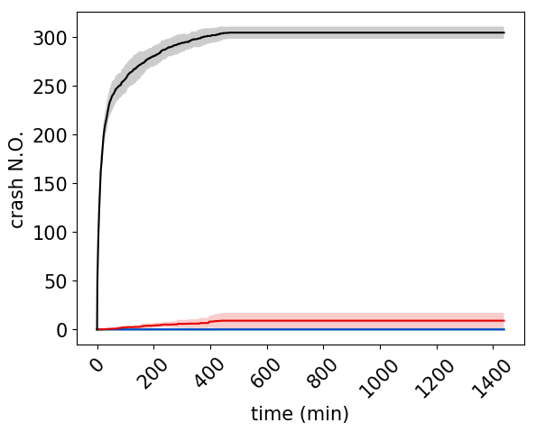
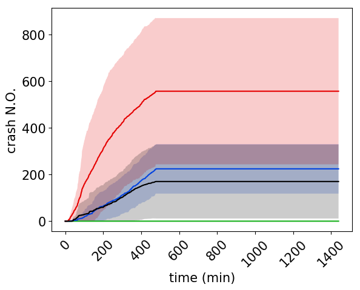

# NASAC2019

This is the demonstration page of the **BiFF**.

# Demos

Fuzzing Under Different Architectures:
- [Intel X64 Demo Link](https://www.bilibili.com/video/av74741732/)
- [Intel X32 Demo Link](https://www.bilibili.com/video/av74745375/)
- [ARM32 Demo Link](https://www.bilibili.com/video/av74741855/)
- [ARM64 Demo Link](https://www.bilibili.com/video/av74749173/)
- MIPS32 (will release soon...)

Fuzzing Native Library of Android:
- [Demo Apk Link](https://www.bilibili.com/video/av74930492/), 
    - MENTION: the video may under auditing of the bilibili website, should be availble in hours

# Full Evaluation Result

Due to the page limiation of the paper, we only show the 3 of 4 benchmark programs' testing results.

Here lists full of them.

And what's more, the result images showed here are drawn with the 95% confidence interval (which is a statistical metric).

## podofopdfinfo

  
   

## cxxfilt

  
   

## nm

  
   

## mjs

  
   

