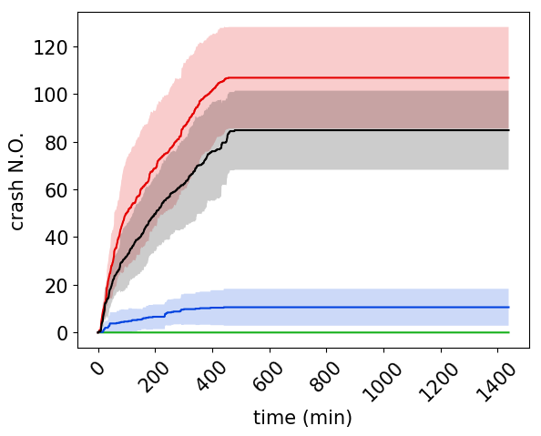

# NASAC2019

This is the demonstration page of the **BiFF**.

# Demos

Fuzzing Under Different Architectures:
- Intel X64 (updating...)
- Intel X32 (updating...)
- ARM32 (updating...)
- ARM64 (updating...)
- MIPS32 (updating...)

Fuzzing Native Library of Android:
- Demo App (updating...)
- What'sapp App (updating...)

# Full Evaluation Result

Due to the page limiation of the paper, we only show the 3 of 4 benchmark programs' testing results.
Here lists full of them.

## podofopdfinfo

  
   

 

## cxxfilt
 

## nm
 

## mjs
 

